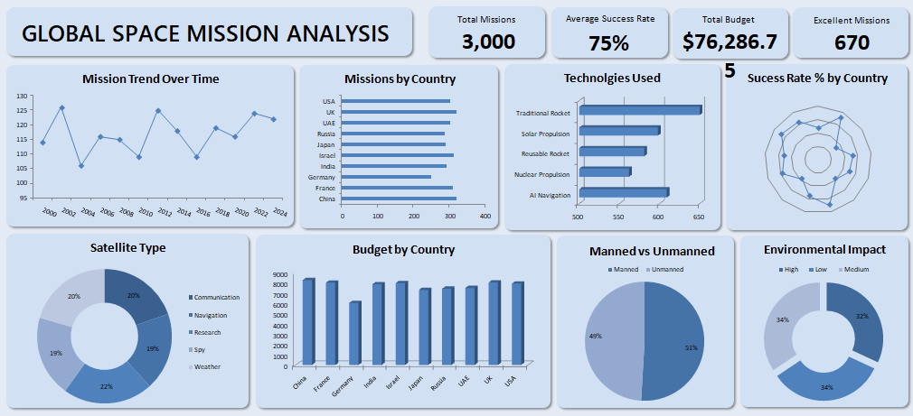

#  Space Mission Analysis Dashboard

## Overview

The **Space Mission Analysis Dashboard** is a comprehensive, interactive Excel-based tool designed to explore and analyze global space exploration missions. It transforms raw mission data into visual insights, tracking space missions across different organizations, locations, and time periods.

## Key Features

- **Mission Status Tracking**: Visualize the success and failure rates of space missions globally.
- **Cost & Budget Insights**: Analyze the expenditure associated with different space programs and missions.
- **Timeline Trends**: Explore the historical progression of space exploration from the mid-20th century to the present.

##  Dashboard Preview

  
<b>Dashboard</b>

   
  
  

## Repository Structure

- `Global_Space_Exploration_Dataset.csv`: The primary dataset containing historical records of global space missions.
- `Space_Mission_Analysis.xlsx`: The interactive Excel workbook containing the processed data, pivot tables, and the final dashboard visualization.

## How to Use

1. **Clone or Download** the repository to your local machine.
2. Ensure you have **Microsoft Excel** (2016 or newer recommended) installed.
3. Open the `Space_Mission_Analysis.xlsx` file.
4. Navigate to the **Dashboard** sheet.
5. Use the provided slicers and filters to interact with the charts and explore the data.

## 📈 Data Source

The analysis is based on the `Global_Space_Exploration_Dataset.csv`, which aggregates public data regarding space launches, including date, company, location, mission status, and rocket cost.

